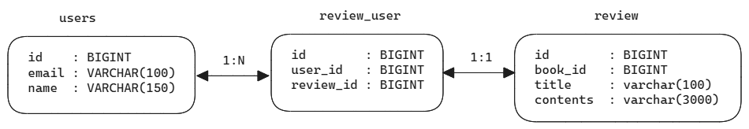

## 연관관계의 주인과 mappedBy

- [JPA 연관관계 매핑](https://colevelup.tistory.com/41)

user 와 user\_history 테이블을 예로 들어보겠습니다. 

user 테이블은 다음과 같이 구성되어 있습니다.

| 컬럼명 | 타입         |
| ------ | ------------ |
| id     | BIGINT       |
| name   | VARCHAR(70)  |
| email  | VARCHAR(100) |

<br/>


이번에는 user\_history 테이블입니다.

| 컬럼명       | 타입     |
| ------------ | -------- |
| id           | BIGINT   |
| user_id (fk) | BIGINT   |
| created\_at  | DATETIME |

<br/>

### user 테이블 - mappedBy 

user 테이블은 마스터 테이블 같은 역할을 합니다.<br/>

user 테이블 내의 기본키는 여러가지 부가적인 정보를 가지는 user\_history, user\_role 등과 같은 여러가지 자식 테이블에서 외래키로 참조합니다.<br/>

user 테이블은 관계형 데이터베이스에서는 마스터 역할을 하지만, 객체관계에서는 mapping 을 당하게 되므로 mappedBy 라는 말로 표현됩니다. 실제로 객체 매핑시에도 mappedBy 를 통한 매핑을 하게 됩니다.<br/>


### user\_history 테이블 - 연관관계의 주인, FK 소유

테이블 관계에서는 마스터 테이블인 user 에 대한 자식테이블 같은 역할을 하지만<br/>

객체 관계에서는 user\_history 가 연관관계의 주인역할을 합니다.<br/>

연관관계의 주인은 외래키(FK) 를 가지고 있으며, 외래키(FK)를 관리(등록, 수정)할 수 있습니다.<br/>

자꾸 헷갈린다면 하나만 기억하시면 됩니다.

- 외래키(FK)를 가지고 있는 테이블이 연관관계의 주인이다.
- 연관관계의 주인 만이 외래키(FK)를 관리(등록, 수정)할 수 있다.
- 반대편 테이블은 mappedBy로 표현된다.

 <br/>


### mappedBy 를 사용하는 이유

참고: [양방향 매핑시 mappedBy가 필요한 이유](https://velog.io/@wogh126/JPA-%EC%96%91%EB%B0%A9%ED%96%A5-%EB%A7%A4%ED%95%91%EC%97%90%EC%84%9C-MappedBy%EA%B0%80-%ED%95%84%EC%9A%94%ED%95%9C-%EC%9D%B4%EC%9C%A0)

예를 들어 User, UserHistory 객체가 각각 서로 User 테이블의 데이터 값을 변경하려 할 경우 무결성이 깨질 수 있습니다. 이때 User, UserHistory 두 객체 중 하나의 객체만 테이블을 관리할 수 있도록 지정하는 옵션은 `mappedBy` 옵션입니다.<br/>


## 이번 문서에서는

이번 문서에서는 N:1 연관관계 예제들을 양방향 예제로 작성합니다.<br/>

편의상 `@Data` 를 사용했습니다. 실무에서는 꼭 `@Data` 를 사용하지 않으시기를 바랍니다.<br/>


## e.g. book (N) vs publisher (1)

publisher(출판사) 에서는 여러 책을 출판할 수 있습니다.<br/>

### Book.java

```java
// ...

@Data
@Entity
@Table(name = "book")
@NoArgsConstructor(access = AccessLevel.PROTECTED)
@AllArgsConstructor(staticName = "ofAll")
@EqualsAndHashCode(exclude = "publisher")
public class Book {
  @Id @GeneratedValue(strategy = GenerationType.IDENTITY)
  private Long id;

  @Column(name = "name", columnDefinition = "VARCHAR(200)")
  private String name;

  @ManyToOne(fetch = FetchType.LAZY)
  @JoinColumn(name = "publisher_id", columnDefinition = "BIGINT")
  private Publisher publisher;
}
```

<br/>


### Publisher.java

```java
// ...

@Data
@Entity
@Table(name = "publisher")
@NoArgsConstructor(access = AccessLevel.PROTECTED)
@AllArgsConstructor
@EqualsAndHashCode(exclude = "publisher")
public class Publisher {
  @Id @GeneratedValue(strategy = GenerationType.IDENTITY)
  private Long id;

  @ToString.Exclude
  @OneToMany(mappedBy = "publisher", cascade = {CascadeType.MERGE, CascadeType.PERSIST})
  private List<Book> books = new ArrayList<>();

  @Column(name = "name", columnDefinition = "VARCHAR(70)")
  private String name;
}
```

<br/>


### schema.sql

```sql
create table book
(
    id           bigint         not null    auto_increment      comment 'id',
    name         varchar(70)    not null    comment '도서명',
    publisher_id bigint         not null    comment '출판사 id',
    primary key (id)
);

create table publisher
(
    id          bigint          not null    auto_increment      comment 'id',
    name        varchar(70)     not null    comment '출판사명',
    primary key (id)
);
```

<br/>


### data.sql

```sql
insert into publisher(name) values ('아침사과');
insert into publisher(name) values ('갤리온');
insert into publisher(name) values ('열린 책들');

insert into book(name, publisher_id) values('글루코스 혁명', 1);
insert into book(name, publisher_id) values('생각 중독', 1);
insert into book(name, publisher_id) values('퀸의 대각선 1', 3);
```

<br/>


### PublisherRepository

```java
package io.summary.jpa.jpa_summary.repository;

import io.summary.jpa.jpa_summary.entity.Publisher;
import org.springframework.data.jpa.repository.JpaRepository;
import org.springframework.data.jpa.repository.Query;
import org.springframework.data.repository.query.Param;

public interface PublisherRepository extends JpaRepository<Publisher, Long> {
  @Query(
      "select p "
    + "from Publisher p "
    + "inner join fetch p.books "
    + "where p.id = :id"
  )
  Publisher findBookByIdFetch(@Param("id") Long id);
}
```

<br/>


### 테스트코드

```java
// ...

@ExtendWith(DatabaseClearExtension.class)
@ActiveProfiles({"mysql-test"})
@SpringBootTest
public class PublisherRepositoryTest {
  @Autowired
  private PublisherRepository publisherRepository;
  @Autowired
  private BookPublisherDataset bookPublisherDataset;

  private static final Logger logger = LoggerFactory.getLogger(PublisherRepositoryTest.class);

  @BeforeEach
  public void init(){
    bookPublisherDataset.fetchDataSql();
  }

  @Transactional
  @Test
  public void test__책정보와_함께_출판사정보를_조회(){
    Publisher publisher = publisherRepository.findBookDetailDtoById(1L);
    logger.info("publisher == {}", publisher.toString());
    publisher.getBooks().forEach(book -> logger.info("book.name = {}", book.getName()));
  }
}
```

<br/>


## e.g. review (N) vs book (1)

book 에는 review 가 여러개 달릴 수 있습니다.<br/>

### Review.java

```java
// ...

@Data
@Entity
@Table(name = "review")
@NoArgsConstructor(access = AccessLevel.PROTECTED)
@AllArgsConstructor(staticName = "ofAll")
public class Review {
  @Id @GeneratedValue(strategy = GenerationType.IDENTITY)
  @Column(name = "id", columnDefinition = "BIGINT")
  private Long id;

  @ManyToOne
  @JoinColumn(name = "book_id", columnDefinition = "BIGINT")
  private Book book;

  @Column(name = "title", columnDefinition = "VARCHAR(100)")
  private String title;

  @Column(name = "contents", columnDefinition = "VARCHAR(3000)")
  private String contents;
}
```

<br/>


### Book.java

```java
// ...

@Data
@Entity
@Table(name = "book")
@NoArgsConstructor(access = AccessLevel.PROTECTED)
@AllArgsConstructor(staticName = "ofAll")
@EqualsAndHashCode(exclude = {"publisher", "reviewList"})
public class Book {
  @Id @GeneratedValue(strategy = GenerationType.IDENTITY)
  @Column(name = "id", columnDefinition = "BIGINT")
  private Long id;

  @Column(name = "name", columnDefinition = "VARCHAR(200)")
  private String name;

  @ManyToOne(fetch = FetchType.LAZY)
  @JoinColumn(name = "publisher_id", columnDefinition = "BIGINT")
  @ToString.Exclude
  private Publisher publisher;

  @OneToMany(mappedBy = "book")
  @ToString.Exclude
  private List<Review> reviewList = new ArrayList<>();
}
```


### schema.sql

```sql
create table book
(
    id           bigint         not null    auto_increment      comment 'id',
    name         varchar(70)    not null    comment '도서명',
    publisher_id bigint         not null    comment '출판사 id',
    primary key (id)
);

create table publisher
(
    id          bigint          not null    auto_increment      comment 'id',
    name        varchar(70)     not null    comment '출판사명',
    primary key (id)
);

create table review
(
    id          bigint          not null    auto_increment      comment 'id',
    book_id     bigint          not null    comment '책 id',
    title       varchar(100)    not null    comment '책 제목',
    contents    varchar(3000)   not null    comment '리뷰 내용',
    primary key (id)
);
```

<br/>


### data.sql

```sql
insert into book(name, publisher_id) values('글루코스 혁명', 1);
insert into book(name, publisher_id) values('생각 중독', 1);
insert into book(name, publisher_id) values('퀸의 대각선 1', 3);

insert into review(book_id, title, contents)
values (
    1, '혈당 스파이크 조심해야 합니다.', '너무 좋은 책이에요. 힘들다고 피곤하다고 당때려넣는게 얼마나 위험한건줄 알게되었어요'
);

insert into review(book_id, title, contents)
values (
    1, '우리 모두 통곡물 많이 먹어보아요.', '정제탄수화물 줄이고 통곡물 식품을 많이 먹어보아요'
);

insert into review(book_id, title, contents)
values (
    1, '혈당, 인슐린 저항성의 모든 원인은 정제탄수화물', '암이 생기는 가장 큰 원인은 혈당과 인슐린 저항성이라고 하지요. 우리 모두 정제 탄수화물을 줄여보아요.'
);
```

<br/>


### ReviewBookDataset

```java
package io.summary.jpa.jpa_summary.repository.fixtures;

import jakarta.persistence.EntityManager;
import java.util.List;
import javax.sql.DataSource;
import org.springframework.context.annotation.Profile;
import org.springframework.core.io.ClassPathResource;
import org.springframework.jdbc.datasource.init.ResourceDatabasePopulator;
import org.springframework.stereotype.Component;
import org.springframework.transaction.annotation.Transactional;

@Profile({"mysql-test"})
@Component
public class ReviewBookDataset {
  private final DataSource dataSource;
  private final EntityManager entityManager;
  public ReviewBookDataset(DataSource dataSource, EntityManager entityManager){
    this.dataSource = dataSource;
    this.entityManager = entityManager;
  }

  @Transactional
  public void init(){
    fetchSchemaSql();
    fetchDataSql();
  }

  @Transactional
  public void truncate(){
    entityManager.clear();

    List<String> tables = entityManager
        .createNativeQuery("SHOW TABLES")
        .getResultList();

    tables.stream()
        .forEach(table -> entityManager
            .createNativeQuery(String.format("TRUNCATE TABLE %s", table))
            .executeUpdate()
        );
  }

  @Transactional
  public void fetchSchemaSql(){
    ClassPathResource resource = new ClassPathResource("schema/schema.sql");
    ResourceDatabasePopulator populator = new ResourceDatabasePopulator(resource);
    populator.execute(dataSource);
  }

  @Transactional
  public void fetchDataSql(){
    ClassPathResource resource = new ClassPathResource("dataset/review_book/data.sql");
    ResourceDatabasePopulator populator = new ResourceDatabasePopulator(resource);
    populator.execute(dataSource);
  }
}
```

<br/>


### BookRepository

```java
package io.summary.jpa.jpa_summary.repository;

import io.summary.jpa.jpa_summary.entity.Book;
import org.springframework.data.jpa.repository.JpaRepository;
import org.springframework.data.jpa.repository.Query;
import org.springframework.data.repository.query.Param;

public interface BookRepository extends JpaRepository<Book, Long> {
  @Query(
      "select b "
      + "from Book b "
      + "inner join fetch b.reviewList "
      + "where b.id = :id"
  )
  Book findBookByIdFetch(@Param("id") Long bookId);
}
```

<br/>


### 테스트코드

```java
// ...

@ActiveProfiles({"mysql-test"})
@SpringBootTest
public class BookRepositoryTest {
  @Autowired
  private BookRepository bookRepository;
  @Autowired
  private ReviewBookDataset dataset;

  private static final Logger logger = LoggerFactory.getLogger(BookRepositoryTest.class);

  @BeforeEach
  public void init(){
    dataset.init();
  }

  @AfterEach
  public void destroy(){
    dataset.truncate();
  }

  @Transactional
  @Test
  public void test__책정보와_함께_리뷰정보를_조회(){
    Book book = bookRepository.findBookByIdFetch(1L);
    logger.info("book == {}", book.toString());
    book.getReviewList().forEach(review -> logger.info("review.title = {}, review.contents = {}", review.getTitle(), review.getContents()));
  }
}
```

<br/>


## e.g. review (N) vs user (1) + 매핑테이블 

### review\_user 매핑 테이블의 도입

Review, User 의 객체 관계를 설정할 때에는 관점이 달라질 수 있을 것 같습니다. 제 경우에는 테이블 관점에서 생각했고, review 테이블이 user\_id 를 FK로 가지고 있는 것이 더 나은 구조인 것 같아서  연관관계의 주인을 review 로 지정했습니다.

- user 테이블 : id, email, name 을 가진 별개의 테이블
- review\_user 테이블
  - id, user\_id, review\_id 를 가진 review 와 user 를 매핑하는 테이블
  - user, review 각각에 대해 연관관계의 주인 역할을 수행
  - user\_id 를 FK 로 가지고 있는다.
  - review\_id 를 FK로 가지고 있는다.

- review 테이블 
  - book\_id 를 FK 로 가지고 있다.
  - user 와의 관계에서는 review\_user 를 통해 접근

<br/>




<br/>

- user는 review 를 여러개 작성할 수 있기 때문에 user와 review\_user 의 관계는 1:N 입니다.

- review 하나는 사용자 한명만 작성할 수 있기 때문에 review\_user 와 review 의 관계는 1:1 입니다.

<br/>


**user : review 로 대응관계를 맞추지 않은 이유**<br/>

이렇게 별도의 매핑테이블인 review\_user 테이블을 따로 둔 이유는 단순히 user : review 관계로만 관계를 설정할 경우에는 userId 로 review 를 조회할때 Review 에서 fetch join 을 하는 것이 아니라 User에서 fetch join 을 통해서 review 리스트를 조회하게끔 됩니다. <br/>

왜냐하면 user : review 관계에서는 테이블 관점에서 생각하면 review 내에 user_id 가 존재하는 것이 합당하게 되기 때문입니다.<br/>

그런데 User 를 통해서 Review를 조회한다는 것은 이치상으로는 조금 부적합합니다. 특정 사용자가 작성한 Review 의 list 를 조회하고 싶은데, Review 가 아닌 User를 통해서 데이터를 조회하고 있기 때문입니다.<br/>


**user : review\_user : review 관계로 매핑**<br/>

위에서 이야기했듯 특정 사용자가 작성한 Review 의 list 를 조회하고 싶은데, Review 가 아닌 User를 통해서 데이터를 조회하는 현상 대신 Review 에서 userId 를 조건값으로 원하는 Review 의 리스트를 조회하기 위해 중간에 review\_user 라는 이름의 매핑테이블을 별도로 두었습니다.<br/>


<br/>


**Review 를 공동작성할 수 있는 경우 - N vs M 가능한지?**<br/>

review 를 공동 작성할 수 있는 경우라면 가능합니다. 하지만 review의 경우 작성자는 1명이어야 합니다. 그래서 review (N) vs user(1) 로 설계했습니다. 만약 이런 경우라면 `review_user` 라는 매핑 테이블로 매핑해야 하며, review\_user 와 review 의 관계는 N:1 로 설정해주셔야 합니다.<br/>


### User.java

```java
// ... 

@Data
@Entity
@Table(name = "users")
public class User {
  @Id @GeneratedValue
  @Column(name = "id", columnDefinition = "BIGINT")
  private Long id;

  @OneToMany(mappedBy = "user", cascade = {CascadeType.MERGE, CascadeType.PERSIST})
  private List<ReviewUser> reviewUserList = new ArrayList<>();

  @Column(name = "email", columnDefinition = "VARCHAR(300)")
  private String email;

  @Column(name = "name", columnDefinition = "VARCHAR(100)")
  private String name;
}
```

<br/>

### ReviewUser.java

```java
// ...

@Data
@Entity
@Table(name = "review_user")
@NoArgsConstructor(access = AccessLevel.PROTECTED)
@AllArgsConstructor
public class ReviewUser {
  @Id @GeneratedValue(strategy = GenerationType.IDENTITY)
  @Column(name = "id", columnDefinition = "BIGINT")
  private Long id;

  @ManyToOne(fetch = FetchType.LAZY)
  @JoinColumn(name = "user_id", columnDefinition = "BIGINT")
  private User user;

  @OneToOne(fetch = FetchType.LAZY)
  @JoinColumn(name = "review_id", columnDefinition = "BIGINT")
  private Review review;
}
```

<br/>

### Review.java

```java
// ...

@Data
@Entity
@Table(name = "review")
@NoArgsConstructor(access = AccessLevel.PROTECTED)
@AllArgsConstructor(staticName = "ofAll")
public class Review {
  @Id @GeneratedValue(strategy = GenerationType.IDENTITY)
  @Column(name = "id", columnDefinition = "BIGINT")
  private Long id;

  @ManyToOne
  @JoinColumn(name = "book_id", columnDefinition = "BIGINT")
  private Book book;

  @OneToOne(mappedBy = "review", cascade = {CascadeType.MERGE, CascadeType.PERSIST})
  private ReviewUser reviewUser;

  @Column(name = "title", columnDefinition = "VARCHAR(100)")
  private String title;

  @Column(name = "contents", columnDefinition = "VARCHAR(3000)")
  private String contents;
}
```

<br/>


### schema.sql

```sql
create table book
(
    id           bigint         not null    auto_increment      comment 'id',
    name         varchar(70)    not null    comment '도서명',
    publisher_id bigint         not null    comment '출판사 id',
    primary key (id)
);

create table publisher
(
    id          bigint          not null    auto_increment      comment 'id',
    name        varchar(70)     not null    comment '출판사명',
    primary key (id)
);

create table review
(
    id          bigint          not null    auto_increment      comment 'id',
    book_id     bigint          not null    comment '책 id',
    title       varchar(100)    not null    comment '리뷰 제목',
    contents    varchar(3000)   not null    comment '리뷰 내용',
    primary key (id)
);

create table review_user
(
    id          bigint          not null    auto_increment      comment 'id',
    user_id     bigint          not null    comment '작성자 id',
    review_id   bigint          not null    comment '리뷰 id',
    primary key (id)
);

create table users
(
    id          bigint          not null    auto_increment      comment 'id',
    email       varchar(100)    not null    comment 'email',
    name        varchar(150)    not null    comment 'name',
    primary key (id)
);
```

<br/>


### data.sql

```sql
insert into book(name, publisher_id) values('글루코스 혁명', 1);
insert into book(name, publisher_id) values('생각 중독', 1);
insert into book(name, publisher_id) values('퀸의 대각선 1', 3);

insert into review(book_id, title, contents)
values (
    1, '혈당 스파이크 조심해야 합니다.', '너무 좋은 책이에요. 힘들다고 피곤하다고 당때려넣는게 얼마나 위험한건줄 알게되었어요'
);

insert into review(book_id, title, contents)
values (
    1, '우리 모두 통곡물 많이 먹어보아요.', '정제탄수화물 줄이고 통곡물 식품을 많이 먹어보아요'
);

insert into review(book_id, title, contents)
values (
    1, '혈당, 인슐린 저항성의 모든 원인은 정제탄수화물', '암이 생기는 가장 큰 원인은 혈당과 인슐린 저항성이라고 하지요. 우리 모두 정제 탄수화물을 줄여보아요.'
);

insert into users(email, name)
values ('aaaaa@email.com', 'aaaaa');

insert into users(email, name)
values ('bbbbb@email.com', 'bbbbb');

insert into users(email, name)
values ('ccccc@email.com', 'ccccc');

insert into users(email, name)
values ('ddddd@email.com', 'ddddd');

insert into users(email, name)
values ('eeeee@email.com', 'eeeee');


insert into review_user(user_id, review_id)
values (1, 1);

insert into review_user(user_id, review_id)
values (1, 2);

insert into review_user(user_id, review_id)
values (1, 3);
```

<br/>


### ReviewUserDataset

```java
package io.summary.jpa.jpa_summary.repository.fixtures;

import jakarta.persistence.EntityManager;
import java.util.List;
import javax.sql.DataSource;
import org.springframework.context.annotation.Profile;
import org.springframework.core.io.ClassPathResource;
import org.springframework.jdbc.datasource.init.ResourceDatabasePopulator;
import org.springframework.stereotype.Component;
import org.springframework.transaction.annotation.Transactional;

@Profile({"mysql-test"})
@Component
public class ReviewUserDataset {
  private final DataSource dataSource;
  private final EntityManager entityManager;
  public ReviewUserDataset(DataSource dataSource, EntityManager entityManager){
    this.dataSource = dataSource;
    this.entityManager = entityManager;
  }

  @Transactional
  public void init(){
    fetchSchemaSql();
    fetchDataSql();
  }

  @Transactional
  public void truncate(){
    entityManager.clear();

    List<String> tables = entityManager
        .createNativeQuery("SHOW TABLES")
        .getResultList();

    tables.stream()
        .forEach(table -> entityManager
            .createNativeQuery(String.format("TRUNCATE TABLE %s", table))
            .executeUpdate()
        );
  }

  @Transactional
  public void fetchSchemaSql(){
    ClassPathResource resource = new ClassPathResource("schema/schema.sql");
    ResourceDatabasePopulator populator = new ResourceDatabasePopulator(resource);
    populator.execute(dataSource);
  }

  @Transactional
  public void fetchDataSql(){
    ClassPathResource resource = new ClassPathResource("dataset/review_user/data.sql");
    ResourceDatabasePopulator populator = new ResourceDatabasePopulator(resource);
    populator.execute(dataSource);
  }
}
```

<br/>


### ReviewRepository

```java
package io.summary.jpa.jpa_summary.repository;

import io.summary.jpa.jpa_summary.entity.Review;
import java.util.List;
import org.springframework.data.jpa.repository.JpaRepository;
import org.springframework.data.jpa.repository.Query;
import org.springframework.data.repository.query.Param;

public interface ReviewRepository extends JpaRepository<Review, Long> {
  // reviewId 를 이용해서 reviewUser 엔티티의 그래프를 들고온다.
  @Query(
      "select r "
      + "from Review r "
      + "join fetch r.reviewUser "
      + "where r.id = :reviewId "
  )
  Review findReviewByReviewId(@Param("reviewId") Long reviewId);

  @Query(
      "select r "
      + "from Review r "
      + "join fetch r.reviewUser " // reviewUser
      + "where r.book.id = :bookId"
  )
  List<Review> findReviewsByBookIdFetch(@Param("bookId") Long bookId);

  @Query(
      "select r "
      + "from Review r "
      + "where r.book.id = :bookId"
  )
  List<Review> findReviewsByBookId(@Param("bookId") Long bookId);

  @Query(
      "select r "
      + "from Review r "
      + "join fetch r.reviewUser " // reviewUser
      + "where r.reviewUser.user.id = :userId"
  )
  List<Review> findReviewByUserId(@Param("userId") Long userId);
}
```

<br/>


### 테스트코드

```java
package io.summary.jpa.jpa_summary.repository;

import io.summary.jpa.jpa_summary.entity.Book;
import io.summary.jpa.jpa_summary.entity.Review;
import io.summary.jpa.jpa_summary.entity.ReviewUser;
import io.summary.jpa.jpa_summary.entity.User;
import io.summary.jpa.jpa_summary.repository.fixtures.ReviewUserDataset;
import java.util.List;
import java.util.Optional;
import org.junit.jupiter.api.AfterEach;
import org.junit.jupiter.api.BeforeEach;
import org.junit.jupiter.api.Test;
import org.slf4j.Logger;
import org.slf4j.LoggerFactory;
import org.springframework.beans.factory.annotation.Autowired;
import org.springframework.boot.test.context.SpringBootTest;
import org.springframework.test.context.ActiveProfiles;
import org.springframework.transaction.annotation.Transactional;

@ActiveProfiles({"mysql-test"})
@SpringBootTest
public class ReviewRepositoryTest {
  @Autowired
  private ReviewRepository reviewRepository;
  @Autowired
  private ReviewUserDataset dataset;
  private static final Logger logger = LoggerFactory.getLogger(ReviewRepositoryTest.class);

  @BeforeEach
  public void init(){
    dataset.init();
  }

  @AfterEach
  public void destroy(){
    dataset.truncate();
  }

  @Transactional
  @Test
  public void test__리뷰정보_한건에_대한_ReviewUser_정보를_조회(){
    Review review = Optional
        .ofNullable(reviewRepository.findReviewByReviewId(1L))
        .orElseThrow(() -> new RuntimeException("일치하는 리뷰가 없습니다."));

    final Book book = review.getBook();
    ReviewUser reviewUser = review.getReviewUser();

    logger.info("bookId = {}, bookName = {}, userId = {}",
        book.getId(),
        book.getName(),
        reviewUser.getUser().getId()
    );
  }

  @Transactional
  @Test
  public void test__책_하나에_대한_리뷰들_조회(){
    // bookRepository 에도 따로 정의한 쿼리 메서드
    // bookRepository 에서 수행하는 것이 더 효율적이다.
    List<Review> reviews = reviewRepository.findReviewsByBookIdFetch(1L);
    reviews.stream()
        .forEach(review -> {
          Book book = review.getBook();
          User user = review.getReviewUser().getUser();
          logger.info("bookId = {}, bookName = {}, userId = {}",
              book.getId(),
              book.getName(),
              user.getName()
          );
        });
  }

  @Transactional
  @Test
  public void test__사용자id에_대한_리뷰들_조회(){
    List<Review> reviews = reviewRepository.findReviewByUserId(1L);

    reviews.stream()
        .forEach(review -> {
          Book book = review.getBook();
          logger.info("bookId = {}, bookName = {}, userId = {}, username = {}",
              book.getId(),
              book.getName(),
              review.getReviewUser().getUser().getId(),
              review.getReviewUser().getUser().getName()
          );
        });
  }

}
```


## e.g. user\_history (N) vs user (1) + 매핑테이블

user 의 활동기록인 user\_history 는 여러개 기록될 수 있습니다.<br/>

**user\_history 역시 user\_history 측에서도 userId 기반으로 조회가 가능하도록 매핑테이블을 두어 변경할지 또는 user\_history 는 단순 Read Only 로 둘지 사용성을 결정해서 예제 범위 변경할지 결정필요**<br/>

> todo 정리 예정

<br/>

