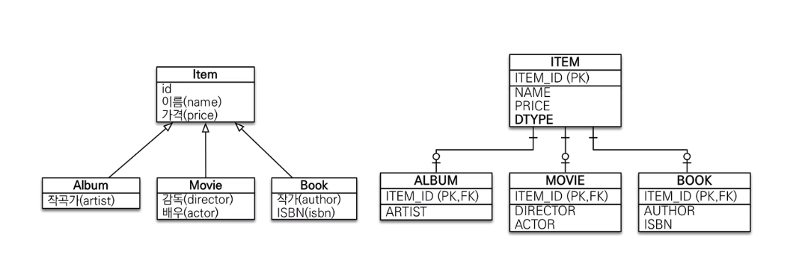
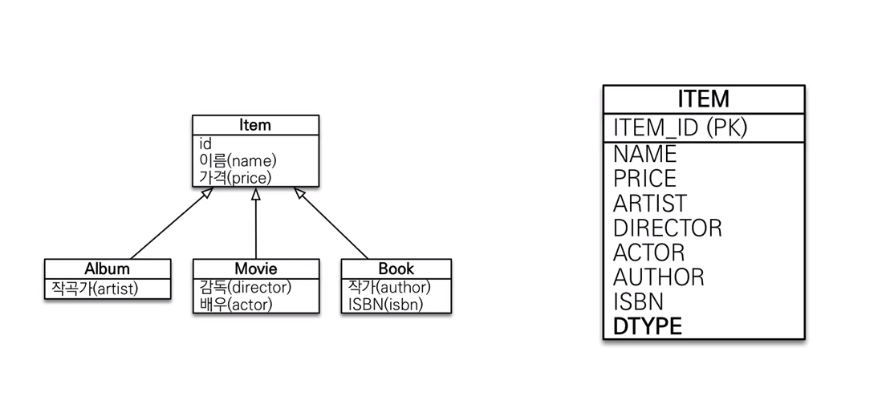
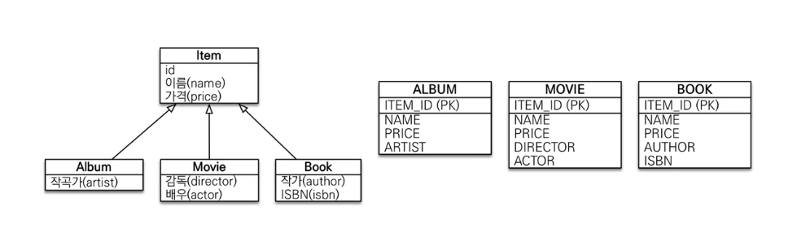
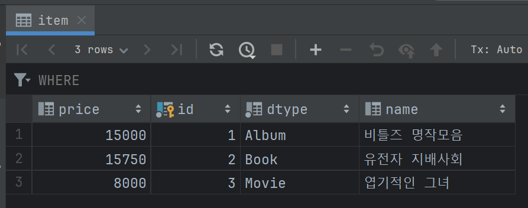
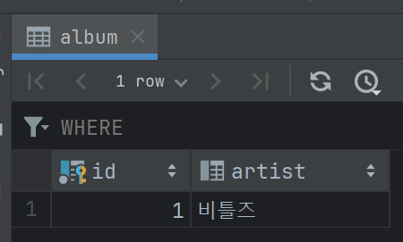
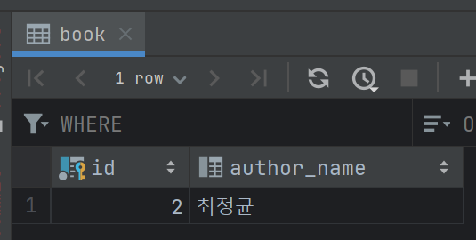
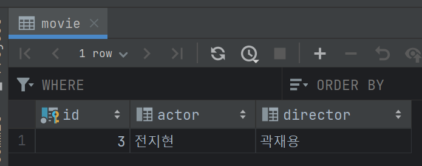

# 상속 관계 매핑 전략 3가지


## 참고자료

- https://ict-nroo.tistory.com/128


## 상속관계 매핑 전략 3가지

상속관계 매핑 전략은 3가지가 있습니다.<br/>

- JOINED (조인 전략)
  - 가장 기본적인 선택입니다.
  - 객체 관계에도 잘 맞으며 정규화도 잘 이뤄지므로 설계가 깔끔하게 이뤄집니다.
  - 테이블이 정규화된다는 점과 저장공간이 효율적으로 사용된다는 장점이 있습니다.
  - 자식테이블은 외래키(FK)를 통해 조인이 가능해집니다. 즉, 외래키 참조 무결성을 가질 수 있습니다.
  - 조회 시에 조인을 많이 사용하게 되며, 조회 쿼리가 복잡해질 수 있다는 점은 단점입니다.
  - 조인을 많이 사용하는 것으로 인해 성능 저하가 발생할 수 있습니다. 하지만 실제로는 영향이 크지 않고 테이블들이 정규화되어 저장공간의 효율성을 극대화하고 일관성있게 데이터를 저장할 수 있게 됩니다.
- SINGLE\_TABLE (단일 테이블 전략)
  - 여러 서브 타입들을 하나의 통합 테이블로 관리하는 전략입니다. 
  - 조회쿼리가 단순해지지만 자식 엔티티가 매핑하는 컬럼 들은 모두 null 을 허용해야 합니다.
  - 단일 테이블에 모든 것을 저장하기에 조인전략에 비해 성능이 느려질 수 있습니다. (일반적으로 성능이 느려지는 임계점을 넘을 일은 드물기는 합니다.)
- TABLE\_PER\_CLASS (구현 클래스마다 테이블 전략)
  - 이 방식은 권장되지 않는 방식입니다.
  - ORM 사용시 데이터 측 또는 객체 측 관점 모두에서 추천되지 않는 방식입니다.
  - 여러 종류의 자식 테이블들을 함께 조회할 때 UNION 을 사용하게 되어서 성능이 좋지 않습니다.
  - 따라서 자식 테이블을 통합해서 쿼리 하기 쉽지 않습니다.
  - 변경 사항 발생시 대응이 쉽지 않아집니다.
    - e.g. ITEM 에 해당하는 개별 ITEM 테이블들을 모두 정산하는 코드가 있을 때 ITEM 의 하위클래스가 추가되면 정산 코드가 변경됩니다. 따라서 하위클래스의 정산결과를 추가하는 등의 코드 변경 작업이 발생하게 됩니다.

<br/>


### JOINED



<br/>


조인전략 (JOINED)

- 가장 기본적인 선택입니다.
- 객체 관계에도 잘 맞으며 정규화도 잘 이뤄지므로 설계가 깔끔하게 이뤄집니다.
- 테이블이 정규화된다는 점과 저장공간이 효율적으로 사용된다는 장점이 있습니다.
- 자식테이블은 외래키(FK)를 통해 조인이 가능해집니다. 즉, 외래키 참조 무결성을 가질 수 있습니다.
- 조회 시에 조인을 많이 사용하게 되며, 조회 쿼리가 복잡해질 수 있다는 점은 단점입니다.
- 조인을 많이 사용하는 것으로 인해 성능 저하가 발생할 수 있습니다. 하지만 실제로는 영향이 크지 않고 테이블들이 정규화되어 저장공간의 효율성을 극대화하고 일관성있게 데이터를 저장할 수 있게 됩니다.

<br/>


### SINGLE\_TABLE



<br/>

단일 테이블 전략

- 여러 서브 타입들을 하나의 통합 테이블로 관리하는 전략입니다. 
- 조회쿼리가 단순해지지만 자식 엔티티가 매핑하는 컬럼 들은 모두 null 을 허용해야 합니다.
- 단일 테이블에 모든 것을 저장하기에 조인전략에 비해 성능이 느려질 수 있습니다. (일반적으로 성능이 느려지는 임계점을 넘을 일은 드물기는 합니다.)

<br/>


### TABLE\_PER_CLASS



구현 클래스마다 테이블 전략 (TABLE\_PER\_CLASS)

- 이 방식은 권장되지 않는 방식입니다.
- ORM 사용시 데이터 측 또는 객체 측 관점 모두에서 추천되지 않는 방식입니다.
- 여러 종류의 자식 테이블들을 함께 조회할 때 UNION 을 사용하게 되어서 성능이 좋지 않습니다.
- 따라서 자식 테이블을 통합해서 쿼리 하기 쉽지 않습니다.
- 변경 사항 발생시 대응이 쉽지 않아집니다.
  - e.g. ITEM 에 해당하는 개별 ITEM 테이블들을 모두 정산하는 코드가 있을 때 ITEM 의 하위클래스가 추가되면 정산 코드가 변경됩니다. 따라서 하위클래스의 정산결과를 추가하는 등의 코드 변경 작업이 발생하게 됩니다.


## e.g. JOINED

이번 테스트 코드 예제에서 살펴볼 내용은 다음과 같습니다.

- ddl-auto 일때 DDL은 어떻게 정의되는지

- Album, Book, Movie 를 모두 insert 할 때 어떻게 insert 되는지

DDL 이 어떻게 구성되는지를 알아야 실무에서 테이블 설계를 한 후 엔티티를 매핑할 수 있게 되기 때문에 비어있는 프로젝트를 만든 후 DDL 을 한번은 출력해보시는 것을 추천드립니다.<br/>


### Item

```java
// ... 
@Data
@Entity
@Table(name = "item")
@Inheritance(strategy = InheritanceType.JOINED)
@DiscriminatorColumn(name = "DTYPE")
@NoArgsConstructor(access = AccessLevel.PROTECTED)
@AllArgsConstructor(staticName = "ofItem")
public class Item {
  @Id
  @GeneratedValue(strategy = GenerationType.IDENTITY)
  @Column(name = "id", columnDefinition = "BIGINT")
  private Long id;
  @Column(name = "name", columnDefinition = "VARCHAR(200)")
  private String name;
  @Column(name = "price", columnDefinition = "DECIMAL")
  private BigDecimal price;
}

```

<br/>


### ItemFactory

Item 의 경우 여기 저기 로직에서 builder 를 통해서 객체를 생성할때 어떤 곳에서는 어떤 값을 누락해서 저장하는 이슈도 생길수 있기 때문에 객체 생성 용도의 Factory 컴포넌트를 별도로 생성했습니다.

```java
package io.summary.jpa.inheritance_entity_mapping.entity.factory;

import io.summary.jpa.inheritance_entity_mapping.entity.Item;
import java.math.BigDecimal;
import org.springframework.stereotype.Component;

@Component
public class ItemFactory {
  public Item newItem(String name, BigDecimal price){
    return Item.ofItem(null, name, price);
  }
}
```

<br/>


### Album

```java
// ...
@Data
@Entity
@Table(name = "album")
@NoArgsConstructor(access = AccessLevel.PROTECTED)
@AllArgsConstructor(staticName = "ofAll")
public class Album extends Item{
  @Column(name = "artist", columnDefinition = "VARCHAR(150)")
  private String artist;

  @Builder(builderClassName = "WithItemBuilder", builderMethodName = "withItemBuilder")
  public Album(String artist, Item item){
    super.setId(item.getId());
    super.setName(item.getName());
    super.setPrice(item.getPrice());
    this.artist = artist;
  }
}
```

<br/>


### Book

```java
// ...

@Data
@Entity
@Table(name = "book")
@NoArgsConstructor(access = AccessLevel.PROTECTED)
@AllArgsConstructor(staticName = "ofAll")
public class Book extends Item{
  @Column(name = "author_name", columnDefinition = "VARCHAR(150)")
  private String authorName;

  @Builder(builderClassName = "WithItemBuilder", builderMethodName = "withItemBuilder")
  public Book(String authorName, Item item){
    super.setId(item.getId());
    super.setName(item.getName());
    super.setPrice(item.getPrice());
    this.authorName = authorName;
  }
}
```

<br/>


### Movie

```java
// ...
@Data
@Entity
@Table(name = "movie")
@NoArgsConstructor(access = AccessLevel.PROTECTED)
@AllArgsConstructor(staticName = "ofAll")
public class Movie extends Item{
  @Column(name = "director", columnDefinition = "VARCHAR(150)")
  private String director;
  @Column(name = "actor", columnDefinition = "VARCHAR(150)")
  private String actor;

  @Builder(builderClassName = "WithItemBuilder", builderMethodName = "withItemBuilder")
  public Movie(String director, String actor, Item item){
    super.setId(item.getId());
    super.setName(item.getName());
    super.setPrice(item.getPrice());
    this.director = director;
    this.actor = actor;
  }
}
```

<br/>


### AlbumRepository

```java
package io.summary.jpa.inheritance_entity_mapping.repository;

import io.summary.jpa.inheritance_entity_mapping.entity.Album;
import org.springframework.data.jpa.repository.JpaRepository;

public interface AlbumRepository extends JpaRepository<Album, Long> {

}
```

<br/>


### BookRepository

```java
package io.summary.jpa.inheritance_entity_mapping.repository;

import io.summary.jpa.inheritance_entity_mapping.entity.Book;
import org.springframework.data.jpa.repository.JpaRepository;

public interface BookRepository extends JpaRepository<Book, Long> {
}
```

<br/>


### MovieRepository

```java
package io.summary.jpa.inheritance_entity_mapping.repository;

import io.summary.jpa.inheritance_entity_mapping.entity.Movie;
import org.springframework.data.jpa.repository.JpaRepository;

public interface MovieRepository extends JpaRepository<Movie, Long> {

}
```

<br/>


### SampleInsertTest

```java
// ...

@ActiveProfiles({"ddl-auto"})
@SpringBootTest
public class SampleInsertTest {
  @Autowired
  private AlbumRepository albumRepository;
  @Autowired
  private BookRepository bookRepository;
  @Autowired
  private MovieRepository movieRepository;
  @Autowired
  private ItemFactory itemFactory;

  @Test
  public void test__insert_sample_data(){
    Item albumItem = itemFactory.newItem("비틀즈 명작모음", BigDecimal.valueOf(15000));
    Album album = Album.withItemBuilder()
        .item(albumItem)
        .artist("비틀즈")
        .build();

    Item bookItem = itemFactory.newItem("유전자 지배사회", BigDecimal.valueOf(15750));
    Book book = Book.withItemBuilder()
        .item(bookItem)
        .authorName("최정균")
        .build();

    Item movieItem = itemFactory.newItem("엽기적인 그녀", BigDecimal.valueOf(8000));
    Movie movie = Movie.withItemBuilder()
        .item(movieItem)
        .actor("전지현")
        .director("곽재용")
        .build();

    albumRepository.save(album);
    bookRepository.save(book);
    movieRepository.save(movie);
  }
}
```

<br/>


### application-ddl-auto.yml

`ddl-auto` 를 `create` 로 지정해서 결과를 확인하게끔 했습니다. 실제 실무에서는 이 설정을 사용하지 않아야 하는 것이 원칙이지만, 이번 예제에서는 동작확인을 위해 아래와 같이 설정했습니다.

```java
spring:
  datasource:
    hikari:
      jdbc-url: jdbc:mysql://127.0.0.1:23306/jpa_mysql?characterEncoding=UTF-8&serverTimezone=UTC&rewriteBatchedStatements=true
      driver-class-name: com.mysql.jdbc.Driver
      username: root
      password: test1357
      schema: jpa_mysql
  jpa:
    hibernate:
      ddl-auto: create
    show-sql: true
```

<br/>


### sql

생성되는 sql 은 아래와 같습니다.

```sql
##### (1)
Hibernate: drop table if exists album
Hibernate: drop table if exists book
Hibernate: drop table if exists item
Hibernate: drop table if exists movie

# ...

##### (2)
Hibernate: create table album (id BIGINT not null, artist VARCHAR(150), primary key (id)) engine=InnoDB
Hibernate: create table book (id BIGINT not null, author_name VARCHAR(150), primary key (id)) engine=InnoDB
Hibernate: create table item (price DECIMAL, id BIGINT not null auto_increment, dtype varchar(31) not null, name VARCHAR(200), primary key (id)) engine=InnoDB
Hibernate: create table movie (id BIGINT not null, actor VARCHAR(150), director VARCHAR(150), primary key (id)) engine=InnoDB

# ...

##### (3)
Hibernate: alter table album add constraint FKrl4nl1yn7tatob2buih6y9qws foreign key (id) references item (id)
Hibernate: alter table book add constraint FKqk00l5u7w76kq5n45m9h5t5rj foreign key (id) references item (id)
Hibernate: alter table movie add constraint FK77hfitoaq24bt17vl2307651e foreign key (id) references item (id)

# ...

##### (4)
####(4.1) : Album insert
### (4.1.1)
Hibernate: insert into item (name,price,dtype) values (?,?,'Album')
### (4.1.2)
Hibernate: insert into album (artist,id) values (?,?)

### (4.2)
Hibernate: insert into item (name,price,dtype) values (?,?,'Book')
Hibernate: insert into book (author_name,id) values (?,?)

### (4.3)
Hibernate: insert into item (name,price,dtype) values (?,?,'Movie')
Hibernate: insert into movie (actor,director,id) values (?,?,?)

// ...
```

(1)

- item, album, book, movie 테이블이 존재한다면 삭제합니다.


(2)

- item, album, book, movie 테이블을 create 합니다.


(3)

- `ddl-auto : create` 를 지정하면 외래키 제약조건이 설정됩니다.
- 실제 현업에서는 외래키 제약조건을 테이블에 걸어두지 않습니다.
- 현재 예제에서는 hibernate가 insert를 어떻게하는지, ddl 은 어떻게 구성하는지 알아보기 위해 `ddl-auto: create` 로 설정해두어서 외래키 제약조건이 생성되어도 그대로 두었습니다.


(4.1) : Album insert

- (4.1.1) : dtype = 'Album' 인 item 데이터를 insert 합니다.
- (4.1.2) : insert 된 item 의 결과값을 기반으로 Album 의 id를 item 의 id 로 지정해서 insert 를 수행합니다. 


(4.2) : Book insert

- (4.2.1) : dtype = 'Book' 인 item 데이터를 insert 합니다.
- (4.2.2) : insert 된 item 의 결과값을 기반으로 Book 의 id를 item 의 id 로 지정해서 insert 를 수행합니다. 


(4.3) : Movie insert

- (4.2.1) : dtype = 'Movie' 인 item 데이터를 insert 합니다.
- (4.2.2) : insert 된 item 의 결과값을 기반으로 Movie 의 id를 item 의 id 로 지정해서 insert 를 수행합니다. 

<br/>


### 저장된 테이블 데이터 확인

Item 테이블



<br/>


album 테이블



<br/>


book 테이블



<br/>


movie 테이블



<br/>


## e.g. SINGLE\_TABLE

추후 시간이 된다면 예제를 업데이트 하겠습니다.


## e.g. TABLE\_PER\_CLASS

추후 시간이 된다면 예제를 업데이트 하겠습니다.

