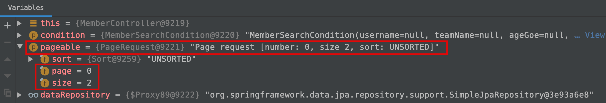
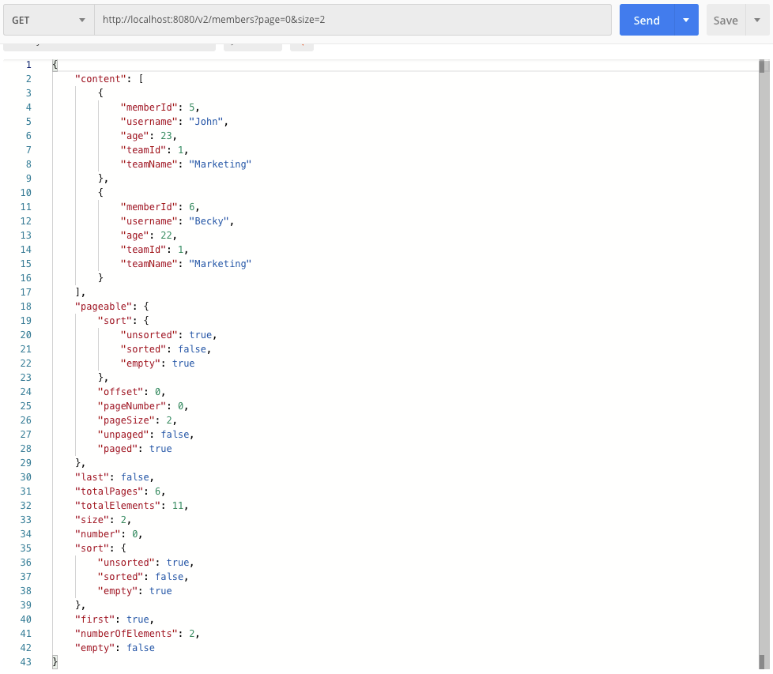

# Querydsl 페이징

Spring Data 의 Pageable, PageRequest 를 사용해서 쿼리를 작성하는 방식을 알아봅니다.<br/>


## Web 계층에서의 Page 파라미터

```java
package com.study.qdsl.web.member;

// ...
@RestController
@RequiredArgsConstructor
public class MemberController {
	private final MemberJpaQdslRepository repository;
	private final MemberDataJpaRepository dataRepository;
  
	// ...
	
    // (1)
  	@GetMapping("/v2/members")
	public Page<MemberTeamDto> getAllMember(MemberSearchCondition condition, Pageable pageable){
		return dataRepository.searchPageSimple(condition, pageable);
	}
  
	// ...
  
}
```

<br/>


(1)

- getAllMembers(... Pageable) 에서는 limit, page, size 없이 Pageable 이라는 객체를 파라미터로 가지고 있습니다.
- 이 경우 스프링 MVC 계층에서는 limit, page, size 에 대한 파라미터를 Pageable 이라는 객체 내의 필드로 바인딩해줍니다.


컨트롤러의 이 Routing 에 대해 Request 는 아래의 URL 로 요청할 수 있습니다.

- [http://localhost:8080/v2/members?page=0&size=2](http://localhost:8080/v2/members?page=0&size=2)

<br/>


그리고 Controller 에서는 실제로 아래와 같이 파라미터가 잘 바인딩되는 것을 볼 수 있습니다.



<br/>


Json 응답형식은 어떨까요. 한번 살펴보면 아래와 같습니다.

http://localhost:8080/v2/members?page=0&size=2 와 같은 API 로 요청을 했을 때의 응답은 다음과 같습니다.



<br/>


- page 가 0 이라는 것은 0 번째 페이지를 가져오겠다는 것이고
- size 가 2 라는 것은 페이지를 2개씩 나누어서 구분하겠다는 것을 의미합니다.

<br/>


## Querydsl 의 페이징 메서드

querydsl 의 페이징 메서드 들은 다음과 같습니다.

- `fetchResults() : QueryResults <T>`
  - Querydsl 의 페이징 기능을 사용할 때는 fetch() 메서드 대신 fetchResults() 메서드를 사용합니다.
  - QueryResults\<T\> 내의 `content` 는 결과 값의 본문을 의미합니다.
  - QueryResults\<T\> 내의 `total` 은 결과 값의 본문을 의미합니다.
  - fetchResults() 메서드를 사용하면 querydsl 내부적으로 두번의 쿼리를 수행합니다. 이 때 수행되는 쿼리는 content 쿼리, count 쿼리입니다.
  - count 쿼리의 경우 잘못 사용하면 좋지 않은 결과를 가져올 수 있습니다. 이런 이유로 조금 우회적인 방식으로 fetchResult()를 사용하지 않기도 합니다. 이것에 대해서는 이 글의 아래에 정리해 두고 있습니다.
  - 개인적으로 가장 제일 좋은 방식은 초기 설계시에 카운트 테이블을 하나 두는 등의 전략을 취하는 것이 가장 좋은 방식이라고 생각합니다.
- `limit (long limit) : JPAQuery<T> `
  - 데이터를 몇 개 단위로 묶어서 페이징할 지를 결정합니다.
  - 0... i ... n-1
  - 만약 30을 지정했다면 30단위로 결과를 나눈결과에 대한 여러개의 페이지가 생성됩니다.
  - JPAQuery\<T\> 를 리턴하는데, 이것은 메서드를 체이닝할 수 있도록 현재 쿼리객체를 리턴함을 의미합니다.
- `offset (long offset) : JPAQuery<T>`
  - 몇 번째 페이지를 보여줄지 명시할 때 사용하는 변수입니다.
  - 데이터를 limit 단위로 나누었을때 만들어진 페이지들 중 몇번째(offset) 페이지를 참조할지를 결정합니다.
  - offset 의 범위는 0... i ... n-1 입니다.
  - JPAQuery\<T\> 를 리턴하는데, 이것은 메서드를 체이닝할 수 있도록 현재 쿼리객체를 리턴함을 의미합니다.

<br/>


## e.g. 1\) 단순한 페이징 기반 Querydsl 코드

Querydsl 코드

```java
// ...

public Page<MemberTeamDto> searchPageSimple(MemberSearchCondition condition, Pageable pageable){
		QueryResults<MemberTeamDto> fetchResults = queryFactory
			.select(new QMemberTeamDto(
				member.id.as("memberId"),
				member.username,
				member.age,
				member.team.id.as("teamId"),
				member.team.name.as("teamName")
			))
			.from(member)
			.leftJoin(member.team, team)
			.where(
				userNameEq(condition),
				teamNameEq(condition),
				ageGoe(condition),
				ageLoe(condition)
			)
			.limit(pageable.getPageSize())
			.offset(pageable.getOffset())
			.fetchResults(); // fetchResults() 를 사용하면 content 쿼리와 count 쿼리 두번을 호출한다.

		List<MemberTeamDto> results = fetchResults.getResults();
		long total = fetchResults.getTotal();
		return new PageImpl<MemberTeamDto>(results, pageable, total);
}

// ...
```

<br/>


테스트

```java
@SpringBootTest
@Transactional
class MemberJpaCustomTest{
  
    @Autowired
    EntityManager em;

    @Autowired
    MemberDataJpaRepository dataJpaRepository;
  
    @BeforeEach
    public void before(){
    Team marketingTeam = new Team("Marketing");
        Team analysisTeam = new Team("Analysis");
        Team musicianTeam = new Team("Musician");
        Team nullTeam = new Team("NullTeam");

        em.persist(marketingTeam);
        em.persist(analysisTeam);
        em.persist(musicianTeam);
        em.persist(nullTeam);

        Member john = new Member("John", 23, marketingTeam);
        Member susan = new Member("Becky", 22, marketingTeam);

        Member kyle = new Member("Kyle", 28, analysisTeam);

        Member aladin = new Member("Aladdin", 35, analysisTeam);
        Member genie = new Member("Genie", 41, analysisTeam);

        Member beethoven = new Member("Beethoven", 251, musicianTeam);
        Member chopin = new Member("Chopin", 210, musicianTeam);
        Member genie2 = new Member("Genie", 210, musicianTeam);
        Member nullName = new Member(null, 100, musicianTeam);

        Member ceo = new Member("Jordan", 49, null);

        em.persist(john);
        em.persist(susan);
        em.persist(kyle);
        em.persist(aladin);
        em.persist(genie);

        em.persist(beethoven);
        em.persist(chopin);
        em.persist(genie2);
        em.persist(nullName);
        em.persist(ceo);
    }
  
    @Test
    public void searchPageSimpleTest(){
        MemberSearchCondition condition = new MemberSearchCondition();

    QMember member = QMember.member;

        // 스프링 데이터의 페이지네이션의 page 는 0번 부터 시작된다.
        PageRequest pageRequest = PageRequest.of(0, 3);
        Page<MemberTeamDto> results = dataJpaRepository.searchPageSimple(condition, pageRequest);

        assertThat(results.getSize()).isEqualTo(3);

        assertThat(results.getContent())
            .extracting("username")
            .containsExactly("John", "Becky", "Kyle");

        System.out.println("results === ");
        System.out.println(results);
    }
}
```

<br/>


## e.g. 2\) 최적화 (1) - Count 시 불필요한 Join 제거

Querydsl 이 반환해주는 fetchResults()를 그대로 사용하지 않고, fetch() 메서드로 `content` 를 가져오고, `total` 값은 count 쿼리를 별도로 정의해서 각각 수행하도록 변경했습니다. 이렇게 하는 경우는 Join 시에 들고오는 데이터가 많을 경우 count 쿼리에도 영향을 줄 수 있기 경우에 해당됩니다.

```java
package com.study.qdsl.repository.custom;

//...

public class MemberJpaCustomImpl implements MemberJpaCustom {

	private final EntityManager em;
	private final JPAQueryFactory queryFactory;

	public MemberJpaCustomImpl(EntityManager em){
		this.em = em;
		queryFactory = new JPAQueryFactory(em);
	}

  // ...
  
	@Override
	public Page<MemberTeamDto> searchPageComplex(MemberSearchCondition condition, Pageable pageable) {

		List<MemberTeamDto> results = queryFactory.select(
			new QMemberTeamDto(
				member.id.as("memberId"),
				member.username.as("username"),
				member.age,
				team.id.as("teamId"),
				team.name.as("teamName")
			)
		)
		.from(member)
		.leftJoin(member.team, team)
		.where(
			userNameEq(condition),
			teamNameEq(condition),
			ageGoe(condition),
			ageLoe(condition)
		)
		.offset(pageable.getOffset())
		.limit(pageable.getPageSize())
		.fetch();
    
		long count = queryFactory.select(member)
			.from(member)
//			.leftJoin(member.team, team) // 필요 없을 때도 있다.
			.where(
				userNameEq(condition),
				teamNameEq(condition),
				ageGoe(condition),
				ageLoe(condition)
			)
			.limit(pageable.getPageSize())
			.offset(pageable.getOffset())
			.fetchCount();

		return new PageImpl<MemberTeamDto>(results, pageable, count);
	}
  // ...
}
```

<br/>


## e.g. 3) 선택적인 count 쿼리

마지막 페이지라는 것이 확실하다면 count 쿼리는 생략해도 됩니다. 마지막 페이지라는게 count 쿼리 없이 Java 코드에서 List 의 size() 를 통해 total 값을 구해낼 수 있기 때문입니다.<br/>


예를 들면 이런 경우입니다.

- 페이지의 시작이면서 컨텐츠의 사이즈가 페이지의 사이즈보다 작을때
  - ex) 페이지의 사이즈는 30개로 정했는데 DB에는 20개의 글 밖에 존재하지 않는 경우
- 가장 마지막 페이지의 데이터를 요청할 때
  - (offset x size) + 리스트.size() 를 통해 전체 사이즈를 구한다.

이렇게 하면 카운트 쿼리 없이 요청 정보와 결과 데이터 만을 잘 조합해서 카운트 쿼리를 수행하지 않아도 됩니다.

<br/>


```java
package com.study.qdsl.repository.custom;

// ...

public class MemberJpaCustomImpl implements MemberJpaCustom {

	private final EntityManager em;
	private final JPAQueryFactory queryFactory;

	public MemberJpaCustomImpl(EntityManager em){
		this.em = em;
		queryFactory = new JPAQueryFactory(em);
	}

	// ...
  
	@Override
	public Page<MemberTeamDto> searchPageOptimized(MemberSearchCondition condition, Pageable pageable) {
		List<MemberTeamDto> results = queryFactory.select(new QMemberTeamDto(
			member.id.as("memberId"),
			member.username.as("username"),
			member.age,
			member.team.id.as("teamId"),
			member.team.name.as("teamName")
		))
		.from(member)
		.leftJoin(member.team, team)
		.where(
			userNameEq(condition),
			teamNameEq(condition),
			ageGoe(condition),
			ageLoe(condition)
		)
		.offset(pageable.getOffset())
		.limit(pageable.getPageSize())
		.fetch();

		/** Query 를 람다 표현식에 저장 */
		JPAQuery<Member> countSql = queryFactory
			.select(member)
			.from(member)
			.where(
				userNameEq(condition),
				teamNameEq(condition),
				ageGoe(condition),
				ageLoe(condition)
			);

		// SQL을 람다 표현식으로 감싸서 람다 또는 메서드 레퍼린스를 인자로 전달해준다.
		// PageableExecutionUtils 에서 위의 1),2) 에 해당하면 SQL 호출을 따로 하지 않는다.
//		return PageableExecutionUtils.getPage(results, pageable, ()->countSql.fetchCount());
		// or
		return PageableExecutionUtils.getPage(results, pageable, countSql::fetchCount);
	}
}
```

<br/>


## e.g. 4) count 가 기획상에서 불필요한 경우

기획상에서 제품에 페이징시 카운트가 필요없다고 결정지었을 경우 굳이 카운트 쿼리를 수행할 필요는 없습니다. 이 경우 fetchResults() 대신 fetch() 메서드를 호출해서 결과를 반환하면 됩니다.<br/>


