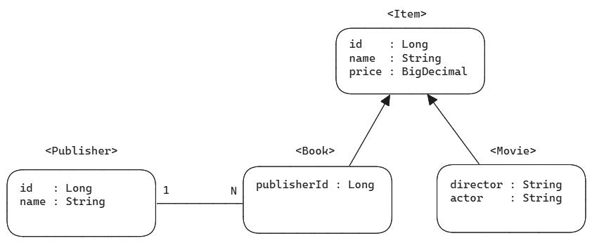

# Querydsl - join(), fetchJoin(), transform()


## Entity, Table 

이번 예제에서 사용할 Entity 구조의 일부분 입니다.



이 중에서도 이번 예제에서는 Publisher, Book 의 관계를 이용해서 Join 예제를 정리해봅니다.<br/>


### item 테이블

| 타입        | 컬럼명 |
| ----------- | ------ |
| BIGINT      | id     |
| VARCHAR(70) | name   |
| DECIMAL     | price  |
| VARCHAR(70) | dtype  |

<br/>


### book 테이블

| 타입   | 컬럼명        |
| ------ | ------------- |
| BIGINT | id            |
| BIGINT | publisher\_id |

<br/>


### publisher 테이블

| 타입        | 컬럼명 |
| ----------- | ------ |
| BIGINT      | id     |
| VARCHAR(70) | name   |

<br/>


### Item 엔티티

```java
// ...

@Data
@Entity
@Table(name = "item")
@Inheritance(strategy = InheritanceType.JOINED)
@DiscriminatorColumn(name = "DTYPE")
@NoArgsConstructor(access = AccessLevel.PROTECTED)
@AllArgsConstructor
public class Item {
  @Id @GeneratedValue(strategy = GenerationType.IDENTITY)
  @Column(name = "id", columnDefinition = "BIGINT")
  private Long id;
  @Column(name = "name", columnDefinition = "VARCHAR(200)")
  private String name;
  @Column(name = "price", columnDefinition = "DECIMAL")
  private BigDecimal price;
}
```

<br/>


### Book 엔티티

```java
// ...

@Data
@Entity
@Table(name = "book")
@NoArgsConstructor(access = AccessLevel.PROTECTED)
@AllArgsConstructor(staticName = "ofAll")
@EqualsAndHashCode(exclude = {"publisher", "reviewList"})
public class Book extends Item {
  @ManyToOne(fetch = FetchType.LAZY)
  @JoinColumn(name = "publisher_id", columnDefinition = "BIGINT")
  @ToString.Exclude
  private Publisher publisher;

  @OneToMany(mappedBy = "book")
  @ToString.Exclude
  private List<Review> reviewList = new ArrayList<>();
}
```

<br/>


### Publisher 엔티티

```java
// ...

@Data
@Entity
@Table(name = "publisher")
@NoArgsConstructor(access = AccessLevel.PROTECTED)
@AllArgsConstructor
public class Publisher {
  @Id @GeneratedValue(strategy = GenerationType.IDENTITY)
  private Long id;

  @ToString.Exclude
  @EqualsAndHashCode.Exclude
  @OneToMany(mappedBy = "publisher", cascade = {CascadeType.MERGE, CascadeType.PERSIST})
  private List<Book> books = new ArrayList<>();

  @Column(name = "name", columnDefinition = "VARCHAR(70)")
  private String name;
}
```

<br/>


### schema.sql

```sql
drop table if exists album;
drop table if exists book;
drop table if exists item;
drop table if exists movie;

drop table if exists publisher;
drop table if exists review;
drop table if exists review_user;
drop table if exists users;

create table item
(
    id          bigint          not null     auto_increment      comment 'id',
    name        varchar(70)     comment '상품명',
    price       decimal         comment '가격',
    dtype       varchar(70)     comment '상품 타입',
    primary key (id)
) engine=InnoDB;

create table book
(
    id           bigint         comment 'id',
    publisher_id bigint         not null    comment '출판사 id',
    primary key (id)
) engine=InnoDB;

create table publisher
(
    id          bigint          not null    auto_increment      comment 'id',
    name        varchar(70)     not null    comment '출판사명',
    primary key (id)
) engine=InnoDB;
```

<br/>


## join()

### 조인의 기본 문법

```plain
join (조인 대상, 별칭으로 사용할 QType)
```

- 첫번째 파라미터 : 조인 대상
- 두번째 파라미터 : 별칭(alias)로 사용할 QType

<br/>


e.g. Publisher, Book(publisher\_id)

```java
public List<Publisher> findAllPublisherWithBookLazy(){
return jpaQueryFactory
    .selectFrom(publisher) 
    .join(publisher.books, book) // (1)
    .fetch();
}
```

(1) 

- 조인 대상 : publisher.books
  - publisher 에 대해 selectFrom 중인데, 이 publisher에서 조인을 할 대상은 publisher 내의 books 입니다. 그래서 publisher.books 를 지정했습니다.
- 별칭으로 사용할 QType
  - 조인할 대상인 publisher.books 는 QType 으로는 QBook.book 입니다. 이 QBook 을 static import 해서 간략하게 book 을 QType 을 지정해줬습니다.

<br/>


e.g. Member(team\_id), Team 의 관계

```java
QMember member = QMember.member;
QTeam team = QTeam.team;

List<Member> musicianMembers = queryFactory.selectFrom(member)
  .join(member.team, team)
  .where(team.name.eq("Musician"))
  .fetch();
```

<br/>


### 기본 조인

기본 조인에는 join(), innerJoin(), leftJoin(), rightJoin() 등이 있습니다. 여러가지 조인 방식에 대해서는 별도의 문서에서 다룰 예정입니다.<br/>


### 기본 조인을 사용할 때 FetchType.Lazy 항목에 대해 N+1 현상

#### e.g. 테스트 코드

```java
@ActiveProfiles({"mysql-test"})
@SpringBootTest
class PublisherQuerydslTest {
  // ...
  // 엔티티 그래프 탐색시 n+1 이 발생하면서 Session 이 없다는 에러가 뜬다.
  // 따라서 Transaction 세션을 타도록 @Transactional 을 추가해줬다.
  @Transactional
  @Test
  public void 테스트_일반_Join___Publisher_엔티티_조회(){
    List<Publisher> publishers = publisherQuerydsl.findAllPublisherWithBookLazy();
    // sql 콘솔에는 join 으로 조회해오는 것 같지만 조인을 하지 않는다. 엔티티 그래프가 비어있는 채로 채워진다.
    logger.info("(1) publishers = {} ", publishers);

    // n+1 발생 (일반 조인을 하게 되면 결과값의 엔티티 그래프는 비어있는 채로 채운다.)
    publishers.stream()
        .forEach(p -> {
          logger.info("(2) publisher name = {}, books = {}", p.getName(), p.getBooks());
        });
  }
}
```

- n+1 이슈가 발생합니다.

<br/>


#### Querydsl 코드

```java
@RequiredArgsConstructor
@Component
public class PublisherQuerydsl {
  private final JPAQueryFactory jpaQueryFactory;
  
  // ...
  
  public List<Publisher> findAllPublisherWithBookLazy(){
    return jpaQueryFactory
        .selectFrom(publisher)
        .join(publisher.books, book)
        .fetch();
  }
}
```

<br/>


#### 쿼리 출력

```plain
### (1)
[Hibernate] 
    select
        p1_0.id,
        p1_0.name 
    from
        publisher p1_0 
    join
        book b1_0 
            on p1_0.id=b1_0.publisher_id
2024-07-21T21:09:46.411+09:00  INFO 31464 --- [           main] i.s.j.j.querydsl.PublisherQuerydslTest   : (1) publishers = [Publisher(id=1, name=아침사과), Publisher(id=2, name=갤리온), Publisher(id=3, name=열린 책들)] 

### (2)
[Hibernate] 
    select
        b1_0.publisher_id,
        b1_0.id,
        b1_1.name,
        b1_1.price 
    from
        book b1_0 
    join
        item b1_1 
            on b1_0.id=b1_1.id 
    where
        b1_0.publisher_id=?
2024-07-21T21:09:46.412+09:00  INFO 31464 --- [           main] i.s.j.j.querydsl.PublisherQuerydslTest   : (2) publisher name = 아침사과, books = [Book(), Book(), Book()]
[Hibernate] 
    select
        b1_0.publisher_id,
        b1_0.id,
        b1_1.name,
        b1_1.price 
    from
        book b1_0 
    join
        item b1_1 
            on b1_0.id=b1_1.id 
    where
        b1_0.publisher_id=?
2024-07-21T21:09:46.436+09:00  INFO 31464 --- [           main] i.s.j.j.querydsl.PublisherQuerydslTest   : (2) publisher name = 갤리온, books = [Book(), Book(), Book()]
[Hibernate] 
    select
        b1_0.publisher_id,
        b1_0.id,
        b1_1.name,
        b1_1.price 
    from
        book b1_0 
    join
        item b1_1 
            on b1_0.id=b1_1.id 
    where
        b1_0.publisher_id=?
2024-07-21T21:09:46.441+09:00  INFO 31464 --- [           main] i.s.j.j.querydsl.PublisherQuerydslTest   : (2) publisher name = 열린 책들, books = [Book(), Book(), Book()]
```

(1)

- publisher 의 데이터를 조회합니다. join 을 했지만 book 의 데이터는 바인딩되어 있지 않습니다.

(2)

- publisher 의 book 리스트를 조회할 때 개별 book 에 대한 값을 조회시에 각각 select 쿼리가 발생합니다.

이렇게 해서 첫 publisher 데이터 조회(1회) + book 리스트 의 개별 아이템 조회(n회) = n+1 회의 조회가 발생했습니다.<br/>

이런 상황에 대한 해결책은 다음과 같습니다.

- `@EntityGraph`
- `JPQL 의 fetch join 을 사용`
- `Querydsl 의 fetch join 을 사용`
- `Querydsl 의 transform 기능을 사용`

Querydsl 은 JPQL 을 기반으로 작성된 라이브러리이기에 JPQL 에서 지원하는 fetch join 을 지원합니다. 이와 같은 fetch join 은 Querydsl 에서 `fetchJoin()` 라는 메서드 명으로 제공됩니다.<br/>

<br/>


## join() 을 사용하더라도 QueryProjection 사용시의 데이터 바인딩

일반 join() 을 사용하더라도 QueryProjection 으로 데이터를 조회 시에는 n+1 이슈가 발생하지 않습니다.

#### e.g. 테스트 코드

```java
@ActiveProfiles({"mysql-test"})
@SpringBootTest
class PublisherQuerydslTest {
  @Autowired
  private PublisherQuerydsl publisherQuerydsl;
  // ...
  
  private final Logger logger = LoggerFactory.getLogger(PublisherQuerydslTest.class);
    
  // ...
  
  
  @Test
  public void 테스트_일반_Join___Publisher_Dto_조회(){
    List<BookDetailDto> list = publisherQuerydsl.findAllBookDetailDtoWithPublisherLazy();
    logger.info("list = {}", list);
    // 특이하다. Dto 조회는 FetchType.Lazy 여도 join 후 Dto에 데이터 프로젝션 하면서  값들이 모두 바인딩 된다.
    // Dto 를 사용해 Projection 할 경우에는 FetchType.Lazy 이더라도 fetch join 을 한다.
  }
  
}
```

<br/>


#### Querydsl 코드

```java
@RequiredArgsConstructor
@Component
public class PublisherQuerydsl {
  private final JPAQueryFactory jpaQueryFactory;
  
  // ...
  
  public List<BookDetailDto> findAllBookDetailDtoWithPublisherLazy(){
    return jpaQueryFactory
        .select(
            new QBookDetailDto(
                publisher.name.as("publisherName"),
                publisher.id.as("publisherId"),
                book.name.as("bookName"),
                book.id.as("bookId")
            )
        )
        .from(publisher)
        .join(publisher.books, book)
        .fetch();
  }
}
```

<br/>


#### 쿼리 출력

```plain
// ...

[Hibernate] 
    select
        p1_0.id,
        p1_0.name,
        b1_0.id,
        b1_1.name 
    from
        publisher p1_0 
    join
        (book b1_0 
    join
        item b1_1 
            on b1_0.id=b1_1.id) 
        on p1_0.id=b1_0.publisher_id
        
### (1)
2024-07-21T21:27:44.500+09:00  INFO 9256 --- [           main] i.s.j.j.querydsl.PublisherQuerydslTest   : publisherList = [PublisherDetailDto(publisherId=1, publisherName=아침사과, books=[BookDto(id=1, name=글루코스 혁명), BookDto(id=2, name=코가 주는 신호를 무시하지 마라), BookDto(id=3, name=인생을 바꾸는 움직임 혁명)]), PublisherDetailDto(publisherId=2, publisherName=갤리온, books=[BookDto(id=4, name=생각 중독), BookDto(id=5, name=대화의 힘), BookDto(id=6, name=챔피언의 마인드)]), PublisherDetailDto(publisherId=3, publisherName=열린 책들, books=[BookDto(id=7, name=퀸의 대각선 1), BookDto(id=8, name=퀸의 대각선 2), BookDto(id=9, name=우리는 왜 잠을 자야 할까)])]

// ... 
```

<br/>

(1)

- Publisher 하나에 대해서 book 의 리스트들이 모두 바인딩 되어 있는 것을 확인할 수 있습니다.


<br/>

<br/>


## fetchJoin()

join() 시에 n+1 을 현상을 방지하기 위해서는 fetchJoin() 을 사용해서 엔티티의 그래프를 통째로 불러옵니다.<br/>


#### e.g. 테스트 코드

```java
@ActiveProfiles({"mysql-test"})
@SpringBootTest
class PublisherQuerydslTest {
  @Autowired
  private PublisherQuerydsl publisherQuerydsl;
  
  // ...

  private final Logger logger = LoggerFactory.getLogger(PublisherQuerydslTest.class);
  
  // ...
  
  @Test
  public void 테스트_fetch_Join__Publisher를_Entity로_조회(){
    List<Publisher> publisherList = publisherQuerydsl.findAllPublisherByFetchJoin();
    publisherList.stream()
        .forEach(p -> {
          logger.info(">>> publisherName = {}", p.getName());
          p.getBooks().stream()
              .forEach(b -> {
                logger.info("bookName = {}", b.getName());
              });
        });
  }
    
  // ...
    
}
```

<br/>


#### Querydsl 코드

```java
@RequiredArgsConstructor
@Component
public class PublisherQuerydsl {
  private final JPAQueryFactory jpaQueryFactory;
    
  // ...
  
  public List<Publisher> findAllPublisherByFetchJoin(){
    return jpaQueryFactory
        .selectFrom(publisher)
        .join(publisher.books, book)
        .fetchJoin()
        .fetch();
  }
}
```

<br/>


#### 쿼리 출력

```plain
[Hibernate] 
    select
        p1_0.id,
        b1_0.publisher_id,
        b1_0.id,
        b1_1.name,
        b1_1.price,
        p1_0.name 
    from
        publisher p1_0 
    join
        (book b1_0 
    join
        item b1_1 
            on b1_0.id=b1_1.id) 
        on p1_0.id=b1_0.publisher_id
        
### (1)
2024-07-22T06:50:59.571+09:00  INFO 28684 --- [           main] i.s.j.j.querydsl.PublisherQuerydslTest   : >>> publisherName = 아침사과
2024-07-22T06:50:59.572+09:00  INFO 28684 --- [           main] i.s.j.j.querydsl.PublisherQuerydslTest   : bookName = 글루코스 혁명
2024-07-22T06:50:59.572+09:00  INFO 28684 --- [           main] i.s.j.j.querydsl.PublisherQuerydslTest   : bookName = 코가 주는 신호를 무시하지 마라
2024-07-22T06:50:59.572+09:00  INFO 28684 --- [           main] i.s.j.j.querydsl.PublisherQuerydslTest   : bookName = 인생을 바꾸는 움직임 혁명
2024-07-22T06:50:59.573+09:00  INFO 28684 --- [           main] i.s.j.j.querydsl.PublisherQuerydslTest   : >>> publisherName = 갤리온
2024-07-22T06:50:59.573+09:00  INFO 28684 --- [           main] i.s.j.j.querydsl.PublisherQuerydslTest   : bookName = 생각 중독
2024-07-22T06:50:59.573+09:00  INFO 28684 --- [           main] i.s.j.j.querydsl.PublisherQuerydslTest   : bookName = 대화의 힘
2024-07-22T06:50:59.573+09:00  INFO 28684 --- [           main] i.s.j.j.querydsl.PublisherQuerydslTest   : bookName = 챔피언의 마인드
2024-07-22T06:50:59.573+09:00  INFO 28684 --- [           main] i.s.j.j.querydsl.PublisherQuerydslTest   : >>> publisherName = 열린 책들
2024-07-22T06:50:59.573+09:00  INFO 28684 --- [           main] i.s.j.j.querydsl.PublisherQuerydslTest   : bookName = 퀸의 대각선 1
2024-07-22T06:50:59.573+09:00  INFO 28684 --- [           main] i.s.j.j.querydsl.PublisherQuerydslTest   : bookName = 퀸의 대각선 2
2024-07-22T06:50:59.573+09:00  INFO 28684 --- [           main] i.s.j.j.querydsl.PublisherQuerydslTest   : bookName = 우리는 왜 잠을 자야 할까
```

(1)

- publisher 와 book 을 fetchJoin() 한 결과를 순회하면서 book 리스트의 각 아이템을 순회할 때 별도의 SQL 이 발생하지 않았습니다.
- n+1 이슈가 발생하지 않았습니다.

<br/>


## fetchJoin() 시 Dto Projection 불가능

fetchJoin() 은 단점이 있습니다. Dto 를 Projection 할 수 없다는 점입니다.<br/>

fetchJoin() 사용시에는 Entity 만을 select 할 수 있습니다. 그외에 Dto 를 바인딩할 경우 IllegalArgumentException 이 발생합니다.<br/>


#### e.g. 테스트 코드

```java
@ActiveProfiles({"mysql-test"})
@SpringBootTest
class PublisherQuerydslTest {
  @Autowired
  private PublisherQuerydsl publisherQuerydsl;

  // ...

  private final Logger logger = LoggerFactory.getLogger(PublisherQuerydslTest.class);
    
  // ...
  
  @Test
  public void 테스트_fetch_Join___Publisher를_Dto로_조회(){
    // (1)
    Assertions.assertThrows(
        IllegalArgumentException.class,
        () -> {
          List<BookDetailDto> bookList = publisherQuerydsl.findAllBookDetailDtoByFetchJoin();

          bookList.stream()
              .forEach(b -> {
                logger.info("book = {}", b);
              });
        }
    );
  }
}
```

(1)

- Fetch Join 의 결과를 BookDetailDto 로 읽어들일 때 IllegalArgumentException 이 발생합니다.

<br/>


#### Querydsl 코드

```java
@RequiredArgsConstructor
@Component
public class PublisherQuerydsl {
  private final JPAQueryFactory jpaQueryFactory;
  // ...
    
  public List<BookDetailDto> findAllBookDetailDtoByFetchJoin(){
    return jpaQueryFactory
        .select(
          new QBookDetailDto(
              publisher.name.as("publisherName"),
              publisher.id.as("publisherId"),
              book.name.as("bookName"),
              book.id.as("bookId")
          )
        )
        .from(publisher)
        .join(publisher.books, book)
        .fetchJoin()
        .fetch();
  }
}
```

<br/>


## transform() 을 사용해서 Dto 를 Projection

transform() 을 사용하는 경우에도 일반 join() 시에 n+1 이 발생하는 문제를 해결할 수 있으며 Dto를 Projection 할 수 있습니다.<br/>


#### e.g. 테스트코드

```java
@ActiveProfiles({"mysql-test"})
@SpringBootTest
class PublisherQuerydslTest {
  @Autowired
  private PublisherQuerydsl publisherQuerydsl;

  // ...
    
  private final Logger logger = LoggerFactory.getLogger(PublisherQuerydslTest.class);
    
  // ...
    
  @Transactional
  @Test
  public void 테스트_transform_메서드로_Publisher_Book_엔티티를_Dto로_조회(){
    List<PublisherDetailDto> publisherList = publisherQuerydsl.findAllBookDetailDtoByTransform();
    logger.info("publisherList = {}", publisherList);
  }
}
```


#### Querydsl 코드

```java
@RequiredArgsConstructor
@Component
public class PublisherQuerydsl {
  private final JPAQueryFactory jpaQueryFactory;
    
  // ...
    
  public List<PublisherDetailDto> findAllBookDetailDtoByTransform() {
    return jpaQueryFactory
        .selectFrom(publisher)
        .join(publisher.books, book)
        .transform(groupBy(publisher.id).list(
            new QPublisherDetailDto(
                publisher.id, publisher.name,
                GroupBy.list(
                    new QBookDto(book.id, book.name)
                )
            )
        ));
  }
}
```

<br/>


#### 쿼리 출력

```plain
[Hibernate] 
    select
        p1_0.id,
        p1_0.name,
        b1_0.id,
        b1_1.name 
    from
        publisher p1_0 
    join
        (book b1_0 
    join
        item b1_1 
            on b1_0.id=b1_1.id) 
        on p1_0.id=b1_0.publisher_id
2024-07-21T21:59:36.644+09:00  INFO 29356 --- [           main] i.s.j.j.querydsl.PublisherQuerydslTest   : publisherList = [PublisherDetailDto(publisherId=1, publisherName=아침사과, books=[BookDto(id=1, name=글루코스 혁명), BookDto(id=2, name=코가 주는 신호를 무시하지 마라), BookDto(id=3, name=인생을 바꾸는 움직임 혁명)]), PublisherDetailDto(publisherId=2, publisherName=갤리온, books=[BookDto(id=4, name=생각 중독), BookDto(id=5, name=대화의 힘), BookDto(id=6, name=챔피언의 마인드)]), PublisherDetailDto(publisherId=3, publisherName=열린 책들, books=[BookDto(id=7, name=퀸의 대각선 1), BookDto(id=8, name=퀸의 대각선 2), BookDto(id=9, name=우리는 왜 잠을 자야 할까)])]

```


